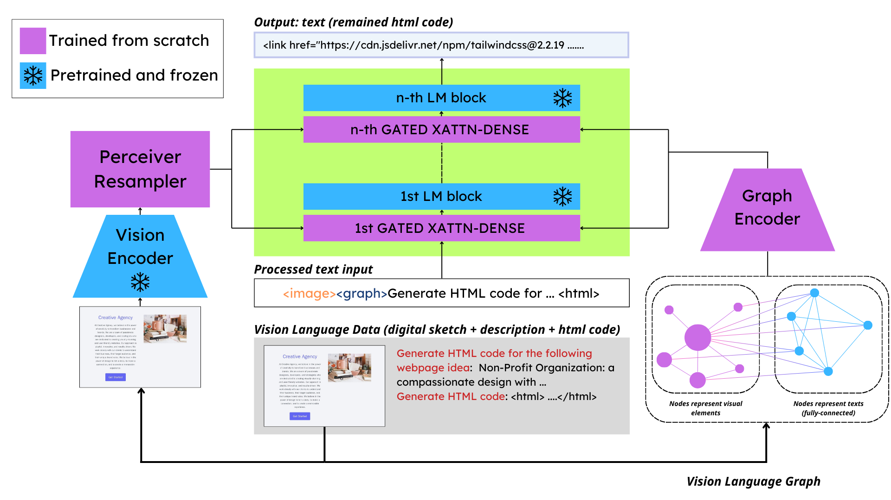

<div align="center">

# Multimodal graph representation learning for website source code generation given visual sketch

<!-- Our technical [report](Multimodal_Graph_Representation_Learning_For_Website_Generation_Based_on_Visual_Sketch.pdf)  -->
</div>

# Overview



<br/><br/>
The Design2Code problem, which involves converting digital designs into functional source code, is a significant challenge in software development due to its complexity and time-consuming nature. Traditional approaches often struggle with accurately interpreting the intricate visual details and structural relationships inherent in webpage designs, leading to limitations in automation and efficiency. In this paper, we propose a novel method that leverages multimodal graph representation learning to address these challenges. By integrating both visual and structural information from design sketches, our approach enhances the accuracy and efficiency of code generation, particularly in producing semantically correct and structurally sound HTML code. We present a comprehensive evaluation of our method, demonstrating significant improvements in both accuracy and efficiency compared to existing techniques. Extensive evaluation demonstrates significant improvements of multimodal graph learning over existing techniques, highlighting the potential of our method to revolutionize design-to-code automation.
<br/><br/>

# Preparation
#### Download our repository
```bash
git clone https://github.com/HySonLab/Design2Code.git
cd Design2Code
```

#### Prepare conda environment and install dependencies (this step may take time)
```bash
conda env create -f environment.yml   # create graphui2code env
conda activate graphui2code           # activate
```

#### Install SAM model for segmentation and simfang.ttf font for visualization
```bash
wget https://dl.fbaipublicfiles.com/segment_anything/sam_vit_b_01ec64.pth            # Install Segment Anything model
```

# Training
#### Before running training script, please go to `scripts/run_train.sh` and modify your own `LD_LIBRARY_PATH` environment variable as follow:
```bash
export LD_LIBRARY_PATH="/path/to/miniconda3/envs/graphui2code/lib"
```
#### Then, run the script as follow:
```bash
sh scripts/run_train.sh
```

# Inferencing
#### Before running inference script, also go to `scripts/run_inference.sh` and modify `LD_LIBRARY_PATH` as follow:
```bash
export LD_LIBRARY_PATH="/path/to/miniconda3/envs/graphui2code/lib"
```
#### Then, run the inference script:
```bash
sh scripts/run_inference.sh
```

# Evaluation on Design2Code metrics
#### Design2Code metrics include Block-Match, Text, Position, Color, CLIP
#### Run the evaluation script as follow:
```bash
python eval/eval_design2code_metrics.py
```

# Evaluation on traditional metrics
#### We also provide code to evaluation on traditional metrics including BLEU, MSE, SSIM, TreeBLEU, WeightedBLEU
```bash
python eval/eval_traditional_metrics.py
```

# Reference
1. [OpenFlamingo](https://github.com/mlfoundations/open_flamingo)
2. [Design2Code](https://github.com/NoviScl/Design2Code)

# Contact us
If you have any questions, comments or suggestions, please do not hesitate to contact us.
- Email: vdtung21.work@gmail.com